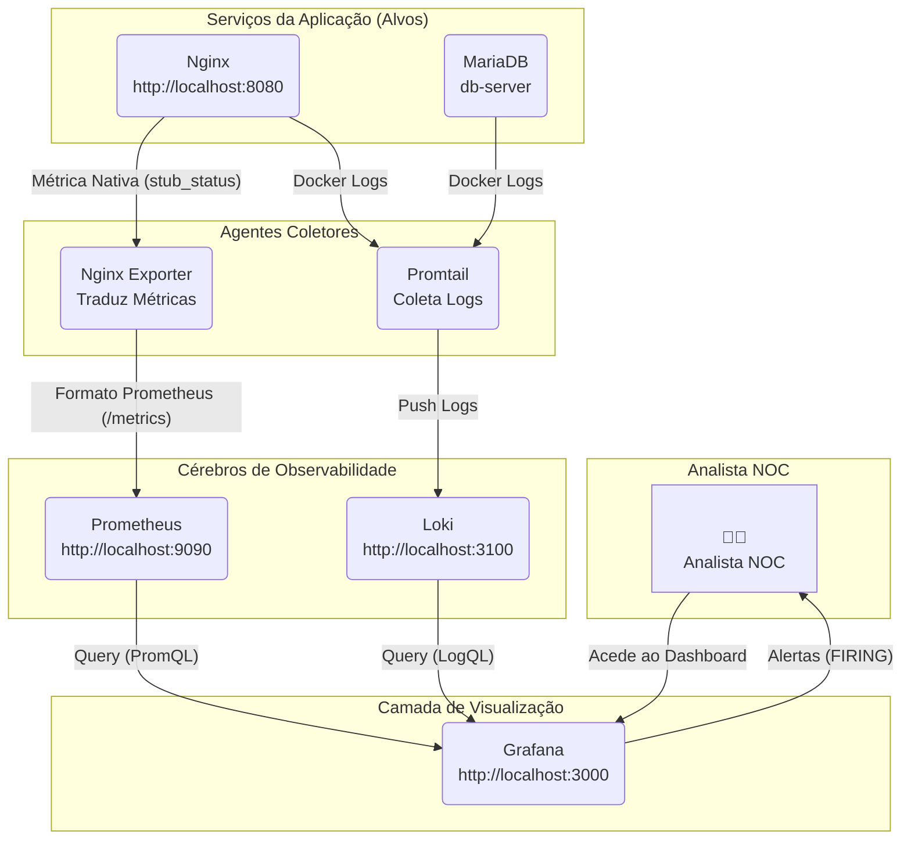

# Projeto de Portfólio: NOC-in-a-Box (Stack de Observabilidade PLG)


Este projeto implementa uma stack de observabilidade "PLG" (Prometheus, Loki, Grafana) completa, orquestrada com Docker Compose para monitorizar uma arquitetura de microsserviços simulada.

O objetivo é demonstrar competências práticas em SRE (Site Reliability Engineering) e DevOps, incluindo monitorização de métricas, agregação de logs centralizados, criação de dashboards e configuração de alertas proativos para resposta a incidentes.

## A User Story

Este projeto foi construído para satisfazer a seguinte *User Story*:

> "Como um aspirante a Analista de NOC e Engenheiro de DevOps Júnior, eu quero construir um projeto completo de 'NOC-in-a-Box' localmente. Eu usarei Docker Compose para simular uma infraestrutura de microsserviços (como um 'servidor_web' Nginx e um 'servidor_db' MySQL) e implantar a stack de observabilidade completa Prometheus, Loki e Grafana (a stack PLG), para que eu possa monitorar métricas de saúde, coletar e consultar logs centralizados de todos os containers, criar dashboards visuais e configurar alertas automáticos (via Alertmanager) que disparam quando um serviço falha."

---

## 🚀 Como Executar

1.  Certifique-se de que tem o Docker e o Docker Compose instalados.
2.  Clone este repositório (`git clone ...`).
3.  Execute o comando a partir da raiz do projeto:
    ```bash
    docker compose up -d
    ```
4.  **Aguarde 1-2 minutos.** Na primeira execução, o Grafana demora a inicializar a sua base de dados interna.

---

## 📍 Pontos de Acesso (Endpoints)

Após o arranque, a stack completa está disponível no seu `localhost`:

* **Aplicação (Nginx):** `http://localhost:8080`
* **Visualização (Grafana):** `http://localhost:3000`
    * **Login:** `admin`
    * **Password:** `admin`
* **Métricas (Prometheus):** `http://localhost:9090`
* **Logs (Loki API):** `http://localhost:3100`

---

## 🏛️ Arquitetura da Solução

Esta stack é composta por 7 serviços Docker, comunicando através de uma rede `bridge` customizada (`monitor-net`), o que permite a descoberta de serviços por DNS interno (ex: `loki:3100`).


Componentes da Stack
Aplicações Alvo:

web-server (Nginx): Simula o frontend da nossa aplicação.

db-server (MariaDB): Simula o backend da nossa aplicação.

Agentes Coletores:

nginx-exporter: Um "tradutor" que lê a página /stub_status do Nginx e a expõe como métricas /metrics que o Prometheus entende (ex: nginx_up).

promtail: O agente da Loki. Ele "ouve" o docker.sock, descobre todos os contentores com a label logging=true, e "empurra" os seus logs para o Loki.

Cérebros (Backends):

prometheus: O nosso banco de dados de séries temporais (TSDB). Ele "raspa" (coleta) ativamente métricas do nginx-exporter e de si mesmo.

loki: O nosso cérebro de agregação de logs. Recebe logs do Promtail e indexa apenas as labels (ex: {job="web"}), tornando-o leve e rápido.

Visualização (Frontend):

grafana: O nosso "painel de vidro único". Foi auto-provisionado no arranque para já "conhecer" o Prometheus e o Loki como fontes de dados. É aqui que construímos dashboards e configuramos alertas.

