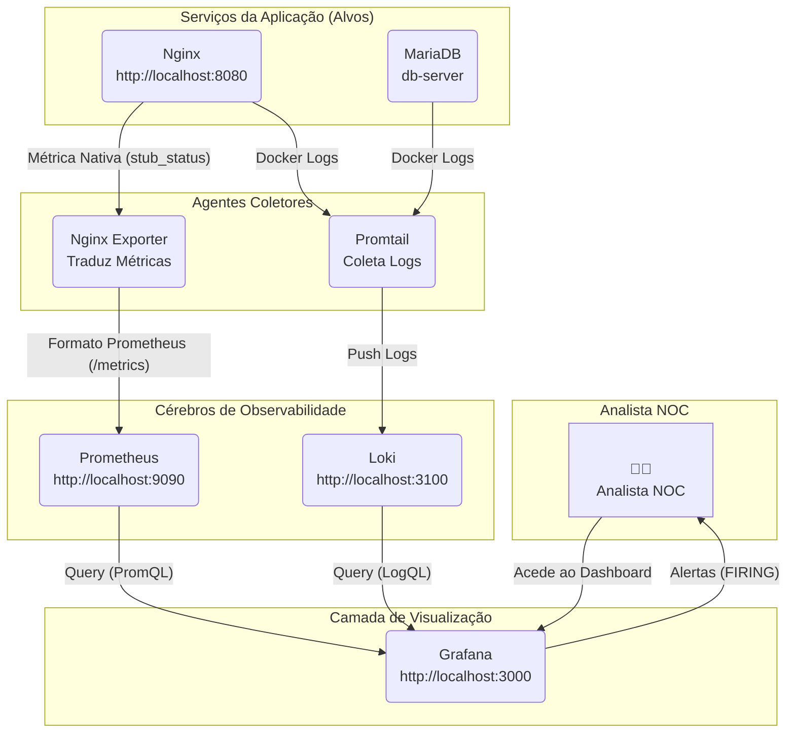

# Projeto de Portfólio: NOC-in-a-Box (Stack de Observabilidade PLG)


Este projeto implementa uma stack de observabilidade "PLG" (Prometheus, Loki, Grafana) completa, orquestrada com Docker Compose para monitorizar uma arquitetura de microsserviços simulada.

O objetivo é demonstrar competências práticas em SRE (Site Reliability Engineering) e DevOps, incluindo monitorização de métricas, agregação de logs centralizados, criação de dashboards e configuração de alertas proativos para resposta a incidentes.

## A User Story

Este projeto foi construído para satisfazer a seguinte *User Story*:

> "Como um aspirante a Analista de NOC e Engenheiro de DevOps Júnior, eu quero construir um projeto completo de 'NOC-in-a-Box' localmente. Eu usarei Docker Compose para simular uma infraestrutura de microsserviços (como um 'servidor_web' Nginx e um 'servidor_db' MySQL) e implantar a stack de observabilidade completa Prometheus, Loki e Grafana (a stack PLG), para que eu possa monitorar métricas de saúde, coletar e consultar logs centralizados de todos os containers, criar dashboards visuais e configurar alertas automáticos (via Alertmanager) que disparam quando um serviço falha."

---

## 🚀 Como Executar

1.  Certifique-se de que tem o Docker e o Docker Compose instalados.
2.  Clone este repositório (`git clone ...`).
3.  Execute o comando a partir da raiz do projeto:
    ```bash
    docker compose up -d
    ```
4.  **Aguarde 1-2 minutos.** Na primeira execução, o Grafana demora a inicializar a sua base de dados interna.

---

## 📍 Pontos de Acesso (Endpoints)

Após o arranque, a stack completa está disponível no seu `localhost`:

* **Aplicação (Nginx):** `http://localhost:8080`
* **Visualização (Grafana):** `http://localhost:3000`
    * **Login:** `admin`
    * **Password:** `admin`
* **Métricas (Prometheus):** `http://localhost:9090`
* **Logs (Loki API):** `http://localhost:3100`

---

## 🏛️ Arquitetura da Solução

Esta stack é composta por 7 serviços Docker, comunicando através de uma rede `bridge` customizada (`monitor-net`), o que permite a descoberta de serviços por DNS interno (ex: `loki:3100`).


Com certeza. Aqui está o seu texto formatado em Markdown profissional para o README.md do seu GitHub, sem nenhuma alteração no conteúdo.

🏗️ Componentes da Stack
Aplicações Alvo:
web-server (Nginx): Simula o frontend da nossa aplicação.

db-server (MariaDB): Simula o backend da nossa aplicação.

Agentes Coletores:
nginx-exporter: Um "tradutor" que lê a página /stub_status do Nginx e a expõe como métricas /metrics que o Prometheus entende (ex: nginx_up).

promtail: O agente da Loki. Ele "ouve" o docker.sock, descobre todos os contentores com a label logging=true, e "empurra" os seus logs para o Loki.

Cérebros (Backends):
prometheus: O nosso banco de dados de séries temporais (TSDB). Ele "raspa" (coleta) ativamente métricas do nginx-exporter e de si mesmo.

loki: O nosso cérebro de agregação de logs. Recebe logs do Promtail e indexa apenas as labels (ex: {job="web"}), tornando-o leve e rápido.

Visualização (Frontend):
grafana: O nosso "painel de vidro único". Foi auto-provisionado no arranque para já "conhecer" o Prometheus e o Loki como fontes de dados. É aqui que construímos dashboards e configuramos alertas.

📸 Galeria do Projeto (Prova de Conceito)
Aqui demonstramos o sistema completo em ação.

💡 Como Adicionar as Suas Imagens ao GitHub:
Faça o upload do seu projeto para o GitHub (como eu lhe mostrei no guia github_guide.md).

No seu repositório GitHub, vá à aba "Issues" e clique em "New Issue".

Arraste e solte (drag and drop) a sua captura de tela (ex: a sua image_132aa5.png) para a caixa de texto da "issue".

O GitHub vai fazer o upload e dar-lhe um link Markdown (ex: ).

Copie esse link de Markdown.

Volte ao seu README.md (clicando no ícone de "Editar"), e cole o link no placeholder correto abaixo.

Feche a "issue" sem a submeter. Repita para todas as imagens.

1. Saúde da Coleta de Métricas (Prometheus)
O Prometheus mostra uma visão de "saúde" de todos os exporters que ele está a monitorizar. Ambos os jobs (prometheus e nginx) estão UP, provando que a coleta de métricas está a funcionar.

2. Dashboard do NOC (Métricas e Logs num só local)
O Grafana permite-nos construir um "painel de vidro único" que combina métricas (do Prometheus) e logs (do Loki).

Como tirar este print:

No Grafana (http://localhost:3000), vá a Dashboards -> New Dashboard.

Adicione um painel. Escolha Prometheus. Na query, coloque nginx_connections_active.

Adicione outro painel. Escolha Loki. Na query, coloque {container="web-server"}.

Organize-os lado a lado e tire o print!

3. ALERTA! Teste de Engenharia de Caos
A prova final é simular uma falha (docker compose rm --stop --force web) e provar que o nosso sistema dispara um alerta. Configurámos uma regra de alerta no Grafana que verifica a métrica nginx_up < 1. Quando o Nginx "morre", o nginx-exporter reporta nginx_up = 0, e o Grafana deteta-o em 10 segundos, mudando o estado para "FIRING".
💡 Lições Aprendidas & Desafios de Depuração
Um projeto só está completo quando se depura os problemas. Esta stack apresentou vários desafios do mundo real que foram cruciais para o aprendizado:

O "Bug" up vs. nginx_up (Lógica de Alerta):
Problema: O meu primeiro alerta (usando up{job="nginx"}) não disparou quando "matei" o contentor web.

Análise: Descobri que up monitoriza o tradutor (nginx-exporter), que continuava a rodar. A métrica correta era nginx_up, que é o que o tradutor reporta sobre o serviço Nginx.

Lição: A métrica que você alerta é mais importante do que o alerta em si. É preciso monitorizar a causa-raiz correta, não um sintoma.

O "Bug" database is locked (Volumes Corrompidos):
Problema: O Grafana não arrancava (ERR_SOCKET_NOT_CONNECTED). Os logs (docker compose logs grafana) mostravam database is locked.

Análise: Múltiplas tentativas de arranque falhadas (devido a outros "bugs" de configuração) corromperam o ficheiro de base de dados SQLite do Grafana, que vive num volume Docker.

Lição: Os contentores são descartáveis, mas os volumes são persistentes. Para "resetar" um serviço, por vezes é preciso destruir não só o contentor (docker compose down), mas também o seu volume (docker volume rm ..._grafana-data).

O "Bug" not a directory (Ficheiros Não Salvos & Caminhos):
Problema: Contentores como o promtail e grafana falhavam ao arrancar com um erro not a directory (não é um diretório).

Análise: O docker-compose.yml tentava montar um ficheiro (ex: ./grafana/datasource.yml) que não existia no host (PC). Isto aconteceu due a ficheiros não salvos no editor de código (o "Bug do Ponto Branco" no VS Code) e nomes de ficheiros/pastas com maiúsculas/minúsculas erradas.

Lição: O Docker é literal. A sua configuração de infraestrutura como código (IaC) tem de espelhar exatamente a estrutura de ficheiros no disco, e você tem de salvar os seus ficheiros.

Este projeto foi uma lição profunda de como os componentes de observabilidade interagem e, mais importante, como os depurar metodicamente quando falham.
