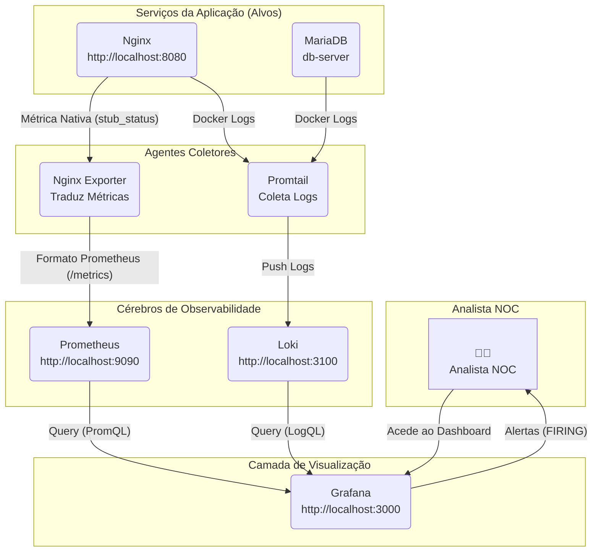

📦 NOC-in-a-Box: Monitoramento e Observabilidade Full-Stack

Uma solução completa de infraestrutura como código (IaC) para monitoramento, coleta de métricas e análise de logs em tempo real.

Este projeto simula um ambiente corporativo real, orquestrando uma arquitetura de microsserviços com Docker Compose. Ele implementa a poderosa stack de observabilidade PLG (Prometheus, Loki, Grafana) para garantir visibilidade total sobre a saúde e o desempenho dos serviços.

🎯 Objetivo do Projeto

Criar um laboratório prático de SRE (Site Reliability Engineering) e DevOps que automatiza a detecção de falhas e a visualização de performance. O foco é demonstrar competências essenciais para analistas de NOC e engenheiros de infraestrutura, como:

Monitoramento de Métricas: Coleta e análise de dados de performance (CPU, memória, requisições).

Agregação de Logs: Centralização e consulta eficiente de logs de múltiplos containers.

Visualização de Dados: Criação de dashboards interativos para tomada de decisão.

Resposta a Incidentes: Configuração de alertas proativos para notificar falhas em tempo real.

🛠️ Arquitetura e Tecnologias

O ambiente é totalmente conteinerizado e orquestrado via Docker Compose, facilitando a implantação e a portabilidade. A comunicação entre os serviços ocorre em uma rede bridge dedicada (monitor-net).

🔹 Aplicações Alvo (O que estamos monitorando?)

Web Server (Nginx): Simula o front-end da aplicação, servindo conteúdo estático e atuando como ponto de entrada.

DB Server (MariaDB): Simula o back-end de persistência de dados.

🔹 Agentes Coletores (Como extraímos os dados?)

nginx-exporter: Um "tradutor" que lê a página de status do Nginx (/stub_status) e a converte em métricas compreensíveis para o Prometheus.

Promtail: O agente de logs. Ele escuta o socket do Docker, coleta logs de todos os containers marcados e os envia para o Loki.

🔹 Cérebros da Operação (Onde armazenamos?)

Prometheus: Banco de dados de séries temporais (TSDB). Ele "raspa" (coleta) métricas periodicamente dos exporters e armazena o histórico de performance.

Loki: Sistema de agregação de logs inspirado no Prometheus. Ele indexa apenas os metadados (labels), tornando a busca e o armazenamento de logs extremamente leves e rápidos.

🔹 Visualização e Alertas (Onde vemos?)

Grafana: O painel de controle central ("Single Pane of Glass"). Ele se conecta ao Prometheus e ao Loki para exibir gráficos, tabelas e logs em um único lugar. Também gerencia os alertas.

Alertmanager: Componente responsável por receber alertas do Prometheus, agrupá-los e enviá-los para canais como E-mail, Slack ou Telegram.

## 🏛️ Arquitetura da Solução

Esta stack é composta por 7 serviços Docker, comunicando através de uma rede `bridge` customizada (`monitor-net`), o que permite a descoberta de serviços por DNS interno (ex: `loki:3100`).

🚀 Como Executar

Pré-requisitos

Docker e Docker Compose instalados.

Passo a Passo

Clone o repositório:

git clone [https://github.com/seu-usuario/noc-in-a-box.git](https://github.com/seu-usuario/noc-in-a-box.git)
cd noc-in-a-box

Suba o ambiente:

docker-compose up -d

Aguarde 1-2 minutos para que todos os serviços inicializem corretamente, especialmente o Grafana.

Acesse os serviços:

Serviço

URL

Credenciais (se houver)

Grafana

http://localhost:3000

admin / admin

Prometheus

http://localhost:9090

-

Aplicação (Nginx)

http://localhost:8080

-

Simule um Incidente (Teste de Caos):
Para testar o sistema de alertas, pare um serviço propositalmente:

docker stop web-server

Verifique o dashboard no Grafana ou o canal de alertas configurado para ver a notificação de falha.

📂 Estrutura do Repositório

.
├── docker-compose.yml      # Orquestração de todos os serviços e redes
├── prometheus/
│   ├── prometheus.yml      # Configuração de scraping (alvos de coleta)
│   └── alert.rules         # Regras de alerta (ex: InstanceDown, HighLatency)
├── grafana/
│   └── provisioning/       # Dashboards e Datasources pré-configurados (IaC)
├── alertmanager/
│   └── config.yml          # Configuração de envio de notificações
├── promtail/
│   └── config.yml          # Configuração de coleta de logs do Docker
└── README.md

💡 Aprendizados e Resultados

Este projeto consolidou conhecimentos práticos em:

Gerenciamento de containers e redes Docker.

Implementação de pipelines de observabilidade modernos.

Configuração de exporters para métricas customizadas.

Criação de dashboards acionáveis para operações de TI.

Fluxo completo de monitoramento proativo.

📞 Contato

Matheus Maciel

LinkedIn

E-mail

Desenvolvido como portfólio prático para atuação em NOC, Infraestrutura e Cibersegurança.
